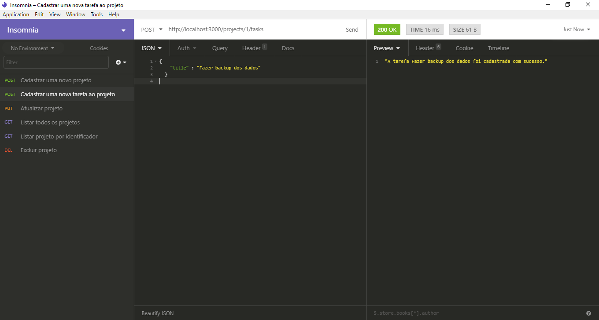
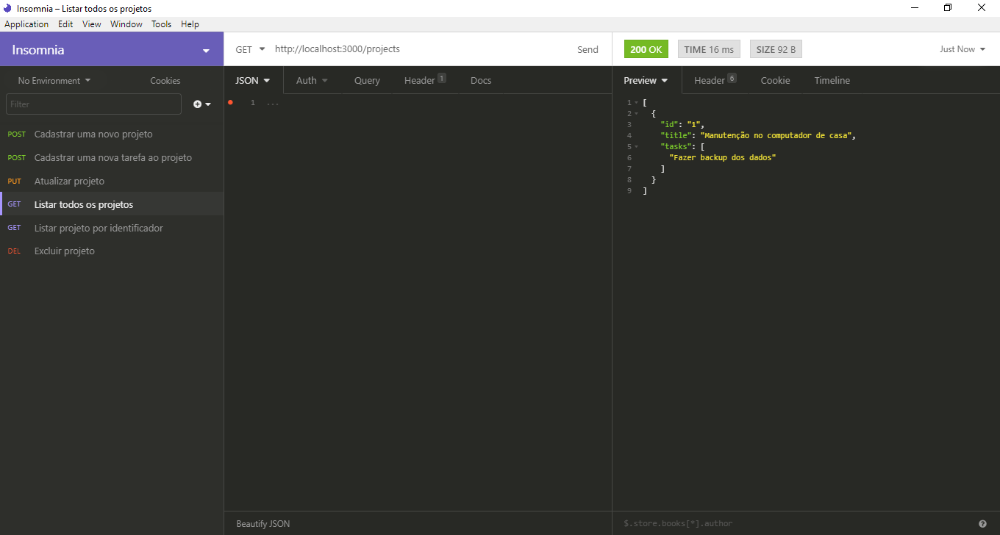
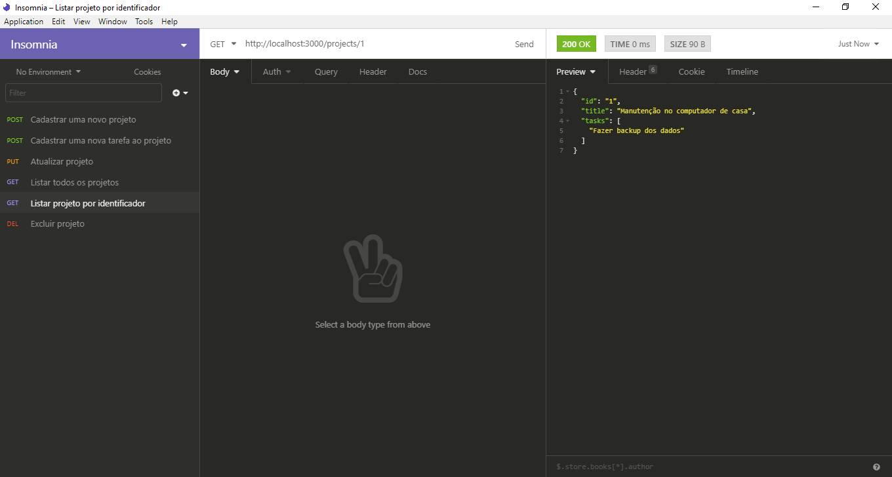
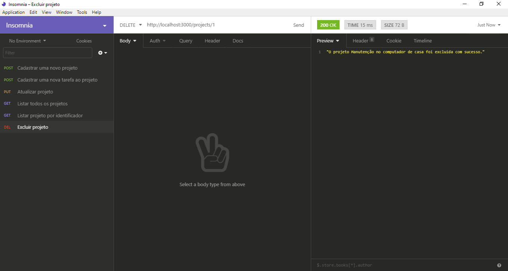

      

Primeira desafio do bootcamp GoStack da Rocketseat. &nbsp;&nbsp;

Sobre o desafio:

Criar uma api para armazenar projetos e suas tarefas utilizando Express e os conceitos de middlewares.

Rotas
POST /projects: A rota deve receber id e title dentro do corpo e cadastrar um novo projeto dentro de um array no seguinte formato: { id: "1", title: 'Novo projeto', tasks: [] }; Certifique-se de enviar tanto o ID quanto o título do projeto no formato string com aspas duplas.

GET /projects: Rota que lista todos projetos e suas tarefas;

PUT /projects/:id: A rota deve alterar apenas o título do projeto com o id presente nos parâmetros da rota;

DELETE /projects/:id: A rota deve deletar o projeto com o id presente nos parâmetros da rota;

POST /projects/:id/tasks: A rota deve receber um campo title e armazenar uma nova tarefa no array de tarefas de um projeto específico escolhido através do id presente nos parâmetros da rota;

Middlewares
Crie um middleware que será utilizado em todas rotas que recebem o ID do projeto nos parâmetros da URL que verifica se o projeto com aquele ID existe. Se não existir retorne um erro, caso contrário permita a requisição continuar normalmente;

Crie um middleware global chamado em todas requisições que imprime (console.log) uma contagem de quantas requisições foram feitas na aplicação até então.

Video do Projeto:

<video width="800" height="600" controls preload>
  <source src="/videos/Desafio01.mp4" type="video/mp4">
  Your browser does not support the video tag.
</video>
 
 

Imagens do projeto: 

      
    
Cadastrar novo projeto 

 

      
    
Cadastrar uma tarefa ao projeto 

 

      
    
Atualizar projeto 

 

      
    
Listar todos os projetos 

 

      
    
Listar projeto por identificador 

 

      
    
Excluir projeto

 